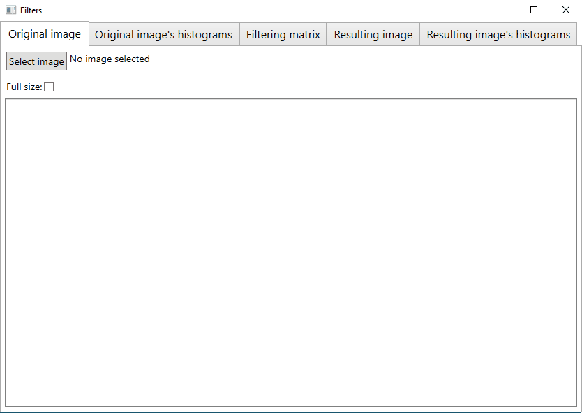

# Filters-WPF
Small WPF app to work with image filters.
User can choose one of prepared filters or create new image filter.
## Demonstration:

## Libraries
* [Microsoft.Tookit.Mvvm](https://github.com/CommunityToolkit/WindowsCommunityToolkit)
* [System.Drawing.Common](https://www.nuget.org/packages/System.Drawing.Common/)
* [Extended WPF Toolkit](https://github.com/xceedsoftware/wpftoolkit)
* [DataGrid2DLibrary](http://www.mediafire.com/file/tm1arm230rr1tgi/DataGrid2DTest.zip/file)
